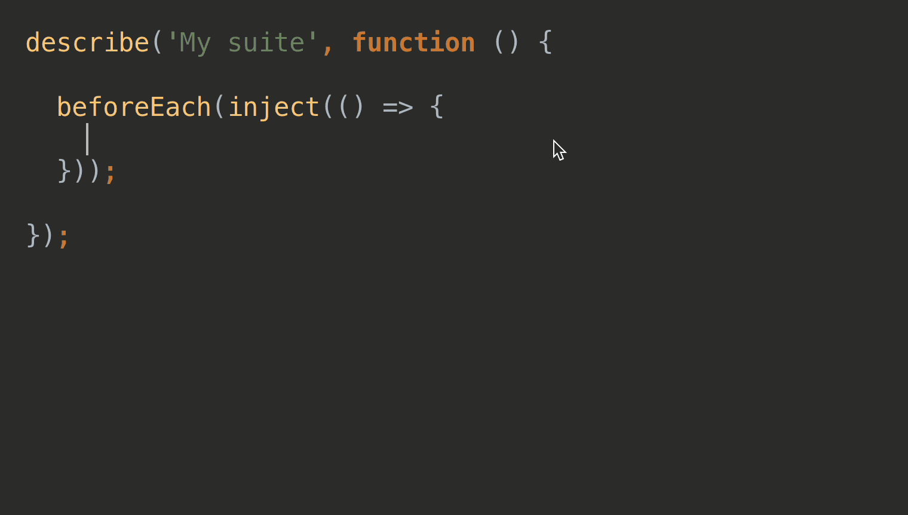
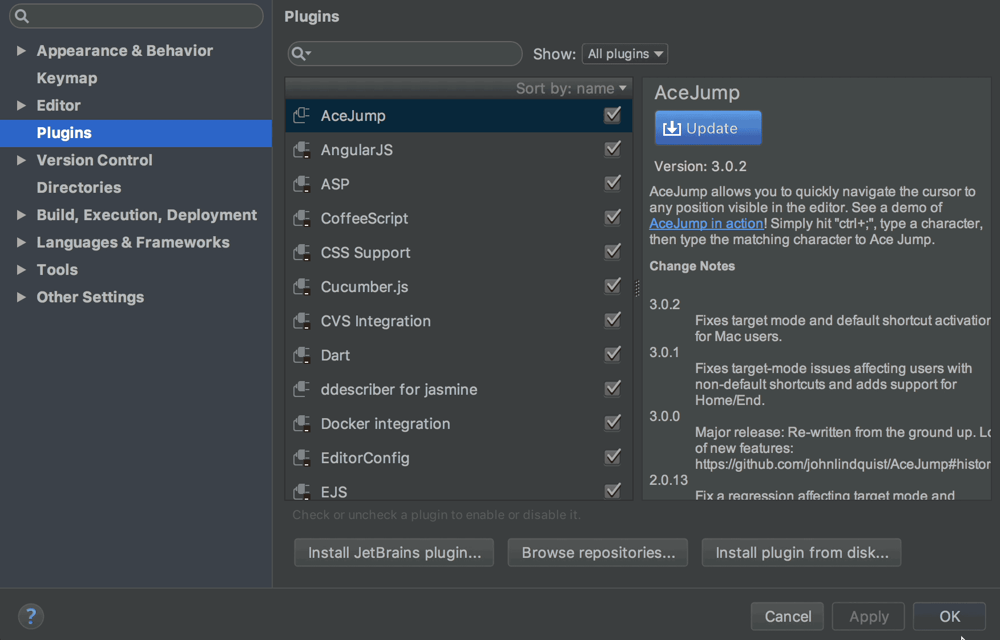

# inject-test
IntelliJ / WebStorm / PhpStorm plugin to inject services for angular jasmine tests.

Adds an injectable parameter and a variable to an Angular 1.x JavaScript 
Jasmine unit test.

Select the name of the service or injectable you want to add to your unit test 
and the plugin will perform the following actions:
      
* Adds a parameter to the inject() function callback
* Assigns the name of the injectable the current selection
* Creates a variable at the top-level descrbe to assign the injectable  

## Installation instructions

* Download inject-test.jar
* Go to Settings / Plugins / Install plugin from disk...
* Restart

 